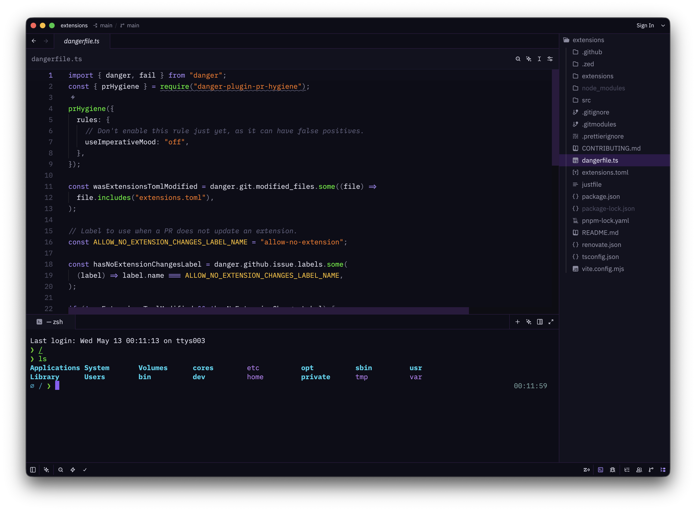
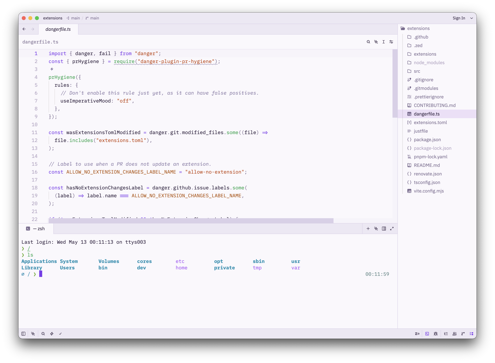

# Evangelion Theme for Zed

A Neon Genesis Evangelion inspired theme for the [Zed](https://zed.dev) editor. Unit 01 purple, LCL orange, and NERV aesthetics.

## Dark

## Light

## Contributing

Pull requests are welcome. More Evangelion color schemes (Unit 00, Unit 02, SEELE, Rebuild, etc.) and readability improvements are appreciated.

If you spot readability issues or other problems, please open an issue.
